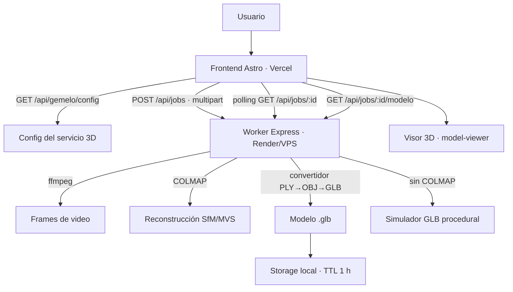

# Spatial Value

Plataforma de tasación automatizada de propiedades que combina datos de
mercado, variables macroeconómicas, análisis de imágenes y **gemelos digitales
3D** para generar reportes técnicos más precisos.

El **gemelo digital** es una réplica 3D interactiva de la propiedad construida
por **fotogrametría** (structure-from-motion + multi-view stereo) a partir de
fotos o videos subidos por el usuario, que se visualiza en el navegador con
`<model-viewer>`.

---

## Arquitectura (resumen)



### Decisiones clave

1. **El procesamiento 3D corre en un worker aparte** (`server/`, Express).
   COLMAP y ffmpeg no pueden ejecutarse en Vercel (serverless): el worker se
   despliega en Render, un VPS o local.
2. **Sin base de datos para este flujo.** Las fotos **nunca se guardan** (se
   borran al terminar) y el modelo vive solo localmente con TTL (1 h por
   defecto). El estado de los trabajos se persiste en JSON local.
3. **Subida directa navegador → worker** (multipart) para evitar los límites de
   tamaño de Vercel. El frontend obtiene la URL del worker desde
   `GET /api/gemelo/config`.
4. **Convertidor PLY → GLB propio** (`server/src/utils/glb.js`), sin
   dependencias pesadas: ideal para el plan free y para generar los modelos de
   demostración del modo simulación.
5. **Modo simulación**: con `GEMELO_MODO=auto`, si COLMAP no está instalado se
   genera un .glb procedural y el flujo completo funciona gratis en cualquier
   lado (desarrollo, Render free).
6. **Confianza por cantidad de fotos**: 5–14 aproximado, 15–29 moderado,
   30–59 bueno, ≥60 alta fidelidad. Tiempos estimados según la especificación
   (5 fotos ≈ 2 min … 100 fotos ≈ 90 min).

Detalle completo: [docs/ARQUITECTURA.md](docs/ARQUITECTURA.md).

---

## Stack

### Frontend (Vercel)
- Astro 6 + React 19 + Tailwind CSS 4 + TypeScript
- `<model-viewer>` (carga dinámica) para el visor 3D

### Backend de tasación (Vercel + Render)
- Endpoints serverless en Astro (`src/pages/Apis/*`) + PostgreSQL (Neon)
- IA de precios: FastAPI/Python en Render (`src/pages/Apis/api_ia.py`)

### Worker 3D (Render / VPS / local — `server/`)
- Node.js + Express + multer
- ffmpeg (frames) · COLMAP (SfM/MVS) · convertidor GLB propio · simulador
- Storage local (default) + S3/Backblaze B2 opcional

## Estructura

```
├── src/                        # Frontend Astro
│   ├── pages/gemelo-digital.astro       # Flujo del gemelo 3D
│   ├── pages/api/gemelo/config.js       # Config pública del worker
│   ├── components/GemeloDigital/        # Subida, progreso, visor, confianza
│   ├── lib/gemelo.ts                    # Cliente del worker + helpers
│   └── ...
├── server/                     # Worker de reconstrucción 3D
│   ├── src/                    # API REST, pipeline, COLMAP, ffmpeg, simulador
│   └── test/                   # 34 tests (vitest + supertest)
├── docs/                       # ARQUITECTURA · API · DESPLIEGUE · USUARIO · PRUEBAS · CRONOGRAMA · MANUAL-DESARROLLADOR
├── scripts/setup-colmap.sh     # Instalación de COLMAP + ffmpeg
├── render.yaml                 # Blueprint de Render (IA + worker 3D)
└── package.json
```

## Quickstart

### 1) Instalar

```bash
npm install            # raíz (frontend)
cd server && npm install && cd ..
```

### 2) Worker 3D (terminal 1)

```powershell
# PowerShell (Windows)
cd server
npm start
```

```bash
# Bash / macOS / Linux
cd server
npm start
```

> **No hace falta escribir variables**: `npm start` carga automáticamente
> `server/.env` (copiá `server/.env.example` → `server/.env` la primera vez,
> viene con `GEMELO_MODO=auto`: usa COLMAP si está instalado y si no, simulador).
> Manual completo para developers: [docs/MANUAL-DESARROLLADOR.md](docs/MANUAL-DESARROLLADOR.md).

### 3) Frontend (terminal 2)

```powershell
# PowerShell (Windows)
npm run dev
```

> `npm run dev` también levanta la IA de tasación (Python). Si no la querés:
> `npx astro dev`.

### 4) Conectar el frontend al worker

Creá `.env.local` en la raíz (agregale esta línea si ya existe):

```
PUBLIC_GEMELO_WORKER_URL=http://localhost:4000
```

Luego reiniciá `npm run dev`.

### 5) Probar

- **Gemelo 3D**: `http://localhost:4321/gemelo-digital` → subí 5+ fotos → "Generar gemelo digital".
- **Desde tasación**: `http://localhost:4321/tasacion` → marcá "Generar gemelo digital 3D" al final.

> En desarrollo, `npm run dev` también levanta la IA de tasación (Python).
> Si no querés la IA, corré solo `npx astro dev`.

## Variables de entorno

Frontend (`.env.local` en la raíz):

| Variable                  | Descripción |
|---------------------------|-------------|
| `PUBLIC_GEMELO_WORKER_URL`| URL pública del worker 3D |
| `SpatialValueStorage_DATABASE_URL` | PostgreSQL (Neon) — ya existente |
| `IA_URL`                  | URL de la IA de tasación (default `http://127.0.0.1:8000`) |

Worker (`server/.env`): ver [server/.env.example](server/.env.example) y
[docs/DESPLIEGUE.md](docs/DESPLIEGUE.md).

## Pruebas

```bash
npm test              # frontend + worker
cd server && npm test # solo worker
npm run build         # build de producción (Vercel)
```

## Despliegue

- **Frontend**: Vercel (adapter de Astro ya configurado).
- **Worker 3D**: Render (plan free, modo simulación) o VPS con Docker + COLMAP.
- Pasos completos en [docs/DESPLIEGUE.md](docs/DESPLIEGUE.md).

## Documentación

| Documento | Contenido |
|-----------|-----------|
| [docs/MANUAL-DESARROLLADOR.md](docs/MANUAL-DESARROLLADOR.md) | **Inicialización para developers**: setup, env, pipeline, troubleshooting |
| [docs/ARQUITECTURA.md](docs/ARQUITECTURA.md) | Arquitectura, diagramas, decisiones y supuestos |
| [docs/API-GEMELO.md](docs/API-GEMELO.md) | Referencia REST del worker y del endpoint de config |
| [docs/DESPLIEGUE.md](docs/DESPLIEGUE.md) | Despliegue (Render free, VPS, Docker, env vars, costos) |
| [docs/MANUAL-USUARIO.md](docs/MANUAL-USUARIO.md) | Guía de uso del gemelo digital |
| [docs/COLMAP-WINDOWS.md](docs/COLMAP-WINDOWS.md) | COLMAP real en Windows vía WSL2 (paso a paso) |
| [docs/PRUEBAS.md](docs/PRUEBAS.md) | Cómo correr y qué cubren los tests |
| [docs/CRONOGRAMA.md](docs/CRONOGRAMA.md) | Sprints MVP y versión completa (gantt) |

## Equipo

- Simón Flomenboim — Frontend
- Jonas Leiserson — Backend
- Liam Lutteral — IA
- Manuel Smulovitz — UX/UI

## Estado del proyecto

Proyecto académico en desarrollo. MVP del gemelo digital 3D funcional
(subida → reconstrucción → visor → descarga) con modo simulación gratuito y
soporte de COLMAP real en VPS.
