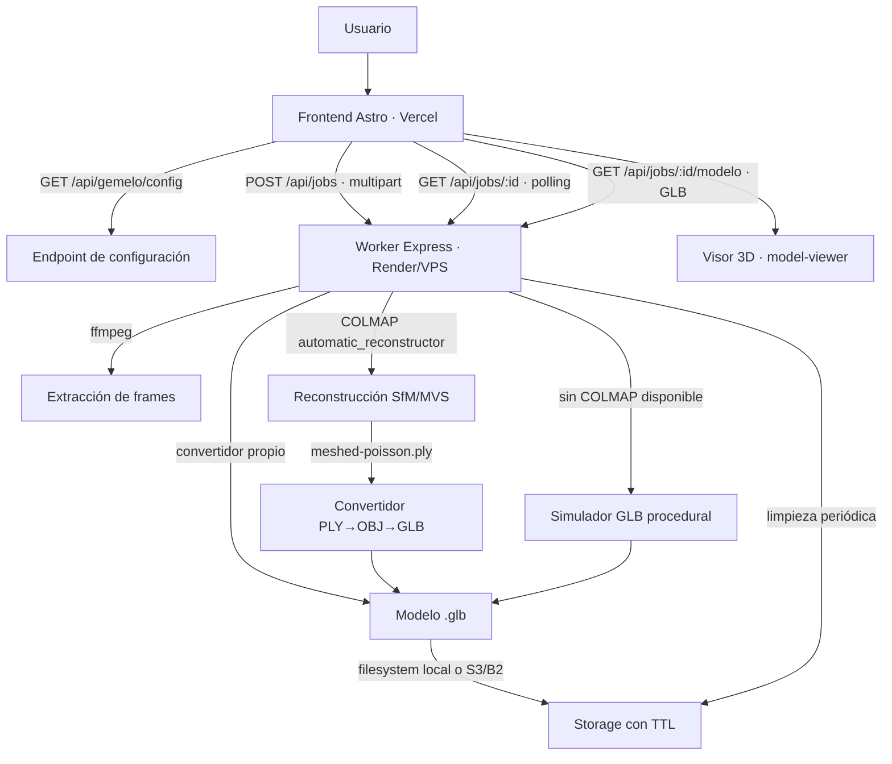
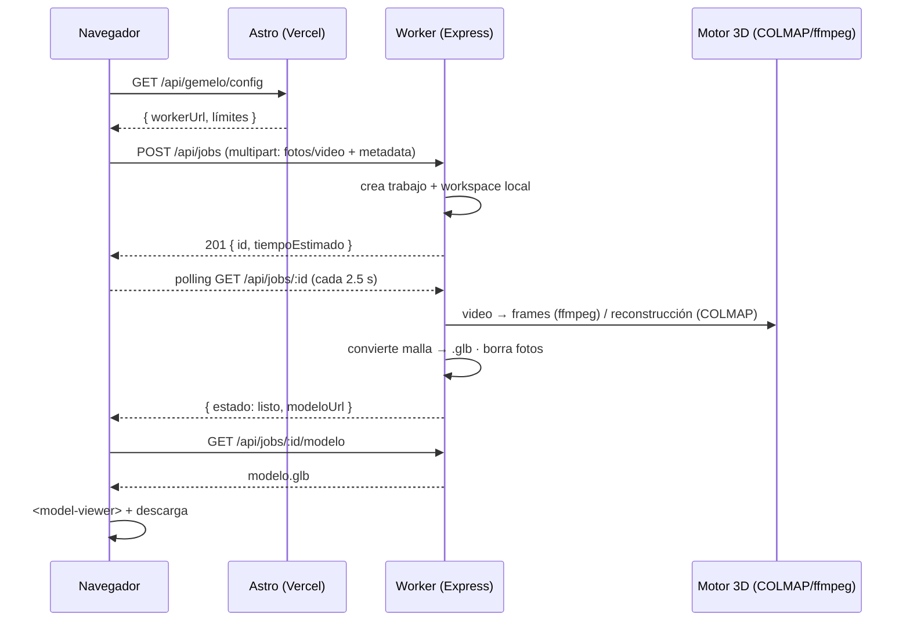

# Arquitectura — Gemelo Digital 3D de Spatial Value

## 1. Visión general

Spatial Value genera **gemelos digitales 3D** de propiedades a partir de fotos o
videos subidos por el usuario. El sistema combina:

- **Fotogrametría clásica (COLMAP)** para reconstruir la geometría real
  (*structure-from-motion* + *multi-view stereo*), con salida de malla `.ply`.
- **Un convertidor propio PLY → OBJ → GLB** (sin dependencias) para servir el
  modelo en el navegador con `<model-viewer>`.
- **Modo simulación** como respaldo gratuito: si COLMAP no está instalado en el
  servidor (plan free, desarrollo), se genera un modelo de demostración
  procedural y el flujo completo funciona de punta a punta.
- **ffmpeg** para extraer cuadros de video (1 fps) y tratarlos como fotos.

## 2. Arquitectura general



### Flujo por trabajo



## 3. Decisiones clave

### 3.1 El procesamiento 3D corre en un worker aparte (no en Vercel)

COLMAP y ffmpeg necesitan un proceso de larga duración con disco, CPU y
potencialmente GPU. Vercel es serverless (sin disco persistente ni procesos
largos). Por eso existe `server/`: una app Express desplegable en Render, un VPS
o local, que es la **única** que toca el pipeline 3D.

### 3.2 Sin base de datos para el flujo de gemelos

Por decisión de producto: **las fotos nunca se guardan** (se borran al terminar
de procesar o al fallar) y **el modelo se guarda solo localmente** en el worker
con TTL (1 h por defecto). El estado de cada trabajo vive en memoria + un JSON
por trabajo en disco. No se agrega ninguna tabla a PostgreSQL.

### 3.3 Subida directa navegador → worker

El navegador sube las fotos directo al worker (multipart con `multer`) para
evitar los límites de tamaño de body de las funciones serverless de Vercel
(~4,5 MB en plan free). Astro solo expone la URL del worker y los límites vía
`/api/gemelo/config`. El worker incluye rate limiting por IP, CORS configurable
y token opcional para endpoints de administración.

### 3.4 Convertidor PLY → GLB propio (sin obj2gltf ni gltf-pipeline)

Escribimos el GLB binario a mano (`server/src/utils/glb.js`): es un formato
estándar y acotado, y evita dependencias pesadas — clave para el plan free
(512 MB de RAM, instalación liviana). El mismo generador produce los modelos de
demostración del simulador y convierte las mallas reales de COLMAP
(`meshed-poisson.ply`, ASCII o binario little-endian).

### 3.5 Modo simulación (gratis, siempre disponible)

`GEMELO_MODO=auto` usa COLMAP si el binario existe; si no, genera un modelo de
demostración procedural determinístico (misma seed = mismo resultado). Esto
permite probar el flujo completo — subida, progreso, visor, descarga — sin
necesitar una VM con GPU. En `auto`, si COLMAP existe pero no produce malla, se
cae al simulador con un mensaje claro.

### 3.6 Visor: model-viewer como base, Three.js para la fase avanzada

El MVP usa **`<model-viewer>`** (carga dinámica, sin fricción SSR/TS), que cubre
rotación, zoom, AR y descarga. **Three.js** queda reservado para el visor
avanzado (nube de puntos, capas y anotaciones, comparador de precios) del
Sprint 5 — es una decisión consciente de alcance, no una omisión.

### 3.7 Confianza y tiempos según cantidad de fotos

Lógica compartida entre frontend (`src/lib/gemelo.ts`) y worker
(`server/src/services/confianza.js` y `tiempo.js`), con tests en ambos lados
para mantenerlas sincronizadas:

| Fotos      | Calidad         |
|------------|-----------------|
| < 5        | Insuficiente (botón deshabilitado) |
| 5–14       | Aproximado      |
| 15–29      | Moderado        |
| 30–59      | Buena fidelidad |
| ≥ 60       | Alta fidelidad  |

Tiempos de referencia (modo fotogrametría): 5 fotos ≈ 2 min, 20 ≈ 10 min,
50 ≈ 40 min, 100 ≈ 90 min (interpolación lineal por tramos). En modo
simulación el tiempo estimado es 15 s + 2 s por foto (tope ~2 min).

## 4. Estructura del repositorio

```
├── src/                     # Frontend Astro (Vercel)
│   ├── pages/
│   │   ├── gemelo-digital.astro      # Página del flujo 3D
│   │   └── api/gemelo/config.js      # Config pública del worker
│   ├── components/GemeloDigital/
│   │   ├── FlujoGemelo.tsx           # Orquestador (subir → progreso → visor)
│   │   ├── SubidaFotos.tsx           # Dropzone, previews, confianza, tiempos
│   │   ├── BarraProgreso.tsx         # Pasos + polling + cancelar
│   │   ├── Visor3D.tsx               # <model-viewer> + descarga
│   │   └── AvisoConfianza.tsx        # Badge de fidelidad
│   ├── lib/gemelo.ts                 # Cliente del worker + helpers
│   └── styles/gemelo.css
├── server/                  # Worker de reconstrucción (Express)
│   ├── src/
│   │   ├── index.js                  # Bootstrap + limpieza TTL
│   │   ├── app.js                    # App Express (CORS, errores)
│   │   ├── config.js                 # Config por env
│   │   ├── estado.js                 # Registro de trabajos (memoria + JSON)
│   │   ├── routes/jobs.js            # API REST del worker
│   │   ├── services/
│   │   │   ├── pipeline.js           # Orquestación del flujo
│   │   │   ├── ffmpeg.js             # Frames de video
│   │   │   ├── colmap.js             # COLMAP automatic_reconstructor
│   │   │   ├── mesh.js               # PLY → OBJ → GLB
│   │   │   ├── simulador.js          # GLB de demostración procedural
│   │   │   ├── confianza.js          # Calidad por nº de fotos
│   │   │   ├── tiempo.js             # Estimaciones de tiempo
│   │   │   ├── storage.js            # Local + S3/B2 opcional
│   │   │   └── limpieza (en estado.js)
│   │   └── utils/glb.js              # Escritor GLB binario sin deps
│   └── test/                         # 23 tests (vitest + supertest)
├── docs/                    # Documentación
├── scripts/setup-colmap.sh  # Instalación de COLMAP + ffmpeg (VPS Linux)
└── render.yaml               # Blueprint Render (frontend IA + worker)
```

## 5. Supuestos y decisiones documentadas

1. **Límites MVP**: 5 fotos mínimas, 100 máximas, 1 video por trabajo, 300 MB
   por archivo. Configurables por env.
2. **Retención**: los modelos viven 1 hora (TTL configurable). Las fotos se
   borran apenas termina (o falla) el procesamiento. Sin almacenamiento
   persistente por defecto.
3. **Fotogrametría con fotos, video como bonus**: un video se convierte a
   cuadros a 1 fps (máx. 100) y se estima equivalente a ~40 fotos.
4. **COLMAP en CPU**: `--use_gpu 0` por defecto para máxima compatibilidad
   gratis; en una VM con GPU se puede cambiar la flag.
5. **Malla**: se usa `dense/0/meshed-poisson.ply` (o `fused.ply`); si COLMAP no
   produce malla, se usa el simulador.
6. **Autenticación del worker**: pública con rate limiting por IP; el token
   (`WORKER_TOKEN`) protege solo endpoints de administración. El frontend no
   guarda secretos.
7. **model-viewer**: se carga dinámicamente (`import('@google/model-viewer')`)
   solo en el cliente, y el elemento se crea imperativamente para evitar
   fricciones de tipos JSX/SSR.
8. **Sin BD**: decisión explícita del equipo (ver 3.2). Si en el futuro se
   quiere historial persistente, se puede sumar una tabla `gemelo_trabajos` en
   Neon sin tocar el pipeline.

## 6. Seguridad

- CORS restringido por env (`CORS_ORIGIN`).
- Rate limiting por IP en `POST /api/jobs`.
- Validación estricta de tipos de archivo (solo imágenes y videos conocidos).
- Los archivos subidos se escriben en directorios temporales con nombres
  sanitizados y se limpian periódicamente.
- El worker no expone rutas de filesystem en sus respuestas (`estado.publico`).
