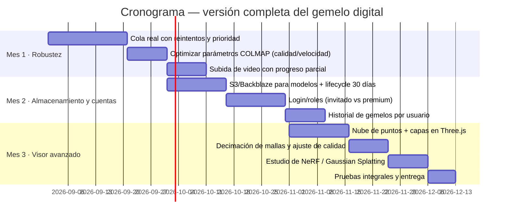

# Cronograma y plan de implementación

## MVP (1 semana) — ya implementado en esta entrega

- [x] Formulario de subida de fotos/video en `/gemelo-digital` (drag & drop, previews).
- [x] Casilla opcional "Generar gemelo digital 3D" en el formulario de tasación.
- [x] Worker Express: `POST /api/jobs`, estado con progreso, descarga del `.glb`, cancelación.
- [x] Extracción de frames con ffmpeg (video → fotos, 1 fps).
- [x] Reconstrucción con COLMAP (`automatic_reconstructor`) cuando está disponible.
- [x] Convertidor PLY → OBJ → GLB propio (sin dependencias).
- [x] **Modo simulación** (gratis): el flujo completo funciona sin COLMAP.
- [x] Mensajes de confianza según nº de fotos + estimaciones de tiempo.
- [x] Barra de progreso con pasos, polling y cancelación.
- [x] Visor 3D (`<model-viewer>`) + descarga del `.glb`.
- [x] No se guardan fotos; modelos con TTL (1 h); sin base de datos.
- [x] Tests automatizados (worker + frontend) y build de producción.
- [x] Despliegue: `render.yaml` (worker free) + Dockerfile + `setup-colmap.sh`.

## Versión completa (meses 1–3)

### Detalle por sprint

**Sprint 1 — Cola y robustez**
- Cola persistente (o reanudable) con reintentos; los trabajos no se pierden si
  el worker se reinicia (hoy pasan a `error`).
- Timeouts y límites por trabajo configurables.
- Métricas básicas en `/api/healthz` (duración media, tasa de éxito).

**Sprint 2 — COLMAP afinado**
- Presets de calidad → parámetros (`--quality`, densidad, decimación).
- GPU opcional (`--use_gpu 1`) si la VM tiene CUDA.
- Postprocesado: recorte de bordes, normalización de escala (para métricas).

**Sprint 3 — Video y UX**
- Progreso real de subida de video (hoy: subida completa + extracción).
- Reanudar trabajos desde el historial del navegador.

**Sprint 4 — Almacenamiento**
- S3/Backblaze B2 (código ya listo en `storage.js`), presigned URLs y lifecycle
  de 30 días para planes premium.
- Guardar "modelo activo" opcional; las fotos siguen sin guardarse.

**Sprint 5 — Visor avanzado**
- Capas de nube de puntos y anotaciones con Three.js.
- Modo comparación de precios sobre el modelo (luxury).

**Sprint 6 — NeRF / Gaussian Splatting (exploración)**
- Evaluar 3D Gaussian Splatting para render realista web/AR (WebXR) manteniendo
  el .glb como formato portable.

## Criterios de aceptación de la versión completa

1. 100 fotos procesadas en menos de 90 min en una VM CPU media.
2. El flujo sobrevive reinicios del worker (cola reanudable).
3. Modelos premium retenidos 30 días; fotos nunca persistidas.
4. Visor con controles completos (rotar, zoom, RA, descarga) en mobile y desktop.
5. Suite de tests verde en CI para frontend y worker.
